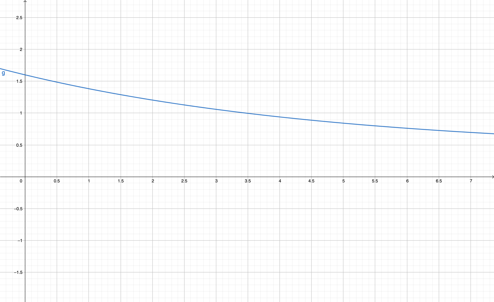

# MCM

$$Q(t)=\mu_1e^{-a_1t}+\dfrac{\mu_1\mu_2(e^{-a_2t}-e^{-a_1t})}{(a_1-a_2)}$$

### parameters

| parameters | Description                                                     |
| ---------- | :-------------------------------------------------------------- |
| $\mu_1$    | Acquired intensity (during learning) of hippocampal/MTL process |
| $\mu_2$    | Consolidation rate to the neocortical process                   |
| $a_1$      | Decline rate of hippocampal/MTL process                         |
| $a_2$      | Decline rate of neocortical process (assumed to be 0 here)      |

